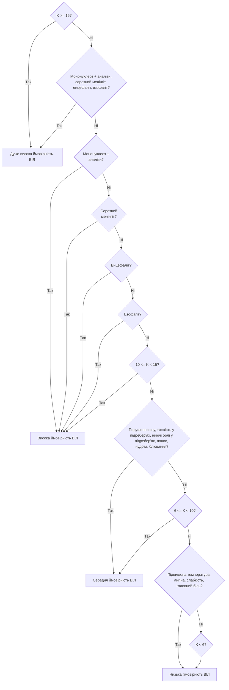

# ЛАБОРАТОРНА РОБОТА 2

## Побудова на Lisp двійкового дерева рішень діагностичної бази знань

**Виконав:** Семен Прохода ІП-з31

### Завдання до роботи:

**Варіант 13:** "ВІЛ-інфекція" <br>
Побудувати двійкове дерево прийняття рішень і реалізувати його на мові Lisp.

### Двійкове дерево



### Лістниг

#### [`hiv.lisp`](./hiv.lisp)

```lisp
;; All symptoms
(defparameter *symptoms* '(
    :fever
    :angina
    :lymph_nodes
    :weakness
    :fatigue
    :sweating
    :headache
    :loss_appetite
    :sleep_disorder
    :liver_enlarged
    :spleen_enlarged
    :heaviness_rhypochondrium
    :dull_pain_rhypochondrium
    :rash
    :diarrhea
    :nausea
    :vomiting
    :retrosternal_pain
    :swallowing_disorder))

;; All analyses
(defparameter *analyses* '(
    :high_leukocytes
    :high_lymphocytes
    :atypical_mononuclear_cells))

;; Mononucleosis symptoms
(defparameter *mono_symptoms* '(
    :fever
    :angina
    :lymph_nodes
    :weakness
    :fatigue
    :sweating
    :headache
    :loss_appetite
    :sleep_disorder
    :liver_enlarged
    :spleen_enlarged
    :heaviness_rhypochondrium
    :dull_pain_rhypochondrium
    :rash
    :diarrhea))

;; Meningitis, Encephalitis symptoms
(defparameter *meningitis_symptoms* '(
    :headache
    :nausea
    :vomiting
    :fever))

(defparameter *encephalitis_symptoms* '(
    :headache
    :nausea
    :vomiting
    :fever))

;; Esophagitis symptoms
(defparameter *esophagitis_symptoms* '(
    :retrosternal_pain
    :swallowing_disorder))

;; Check if any item from items is in lst
(defun member-any (lst items)
    (some #'(lambda (x) (member x lst)) items))

;; Check if subset is contained in set
(defun subset-p (subset set)
    (every #'(lambda (x) (member x set)) subset))

(defun count-symptoms (patient)
    (length (getf patient :symptoms)))

(defun has-analyses (patient)
    (member-any (getf patient :analyses) *analyses*))

(defun has-mono-symptoms (patient)
    (subset-p '(:angina :lymph_nodes) (getf patient :symptoms)))

(defun has-mono-analyses (patient)
    (has-analyses patient))

(defun has-mono-diagnosis (patient)
    (and (has-mono-symptoms patient) (has-mono-analyses patient)))

(defun has-meningitis (patient)
    (subset-p '(:nausea :vomiting) (getf patient :symptoms)))

(defun has-encephalitis (patient)
    (subset-p '(:nausea :vomiting) (getf patient :symptoms)))

(defun has-esophagitis (patient)
    (subset-p '(:retrosternal_pain :swallowing_disorder) (getf patient :symptoms)))

;; Decision tree
(defun hiv-probability (patient)
    (let ((k (count-symptoms patient)))
        (cond
            ((or (>= k 15)
                (and (has-mono-symptoms patient)
                    (has-mono-analyses patient)
                    (has-meningitis patient)
                    (has-encephalitis patient)
                    (has-esophagitis patient)))
            :very-high)
            ((or (has-mono-diagnosis patient)
                (has-meningitis patient)
                (has-encephalitis patient)
                (has-esophagitis patient))
            :high)
            ((or (and (<= 10 k) (< k 15))
                (member-any
                    (getf patient :symptoms)
                    '(:sleep_disorder :heaviness_rhypochondrium :dull_pain_rhypochondrium :diarrhea :nausea :vomiting)))
            :moderate)
            ((or (and (<= 6 k) (< k 10))
                (subset-p
                    '(:fever :angina :weakness :headache)
                    (getf patient :symptoms)))
            :low)
            (t :low))))


;; Patient example
(defparameter *patient1*
    (list
        :symptoms '(:fever :angina :lymph_nodes :diarrhea :nausea :vomiting :retrosternal_pain :headache :fatigue)
        :analyses '(:high_leukocytes)))

;; Demo
(defun diagnosis-report (patient)
    (format t "Symptoms: ~A~%" (getf patient :symptoms))
    (format t "Analyses: ~A~%" (getf patient :analyses))
    (format t "HIV Probability: ~A~%" (hiv-probability patient)))

(diagnosis-report *patient1*)
```

### Результати роботи програми

Запуск програми `clisp hiv.lisp`, виконується функція `(diagnosis-report *patient1*)`

```
> clisp hiv.lisp
Symptoms: (FEVER ANGINA LYMPH_NODES DIARRHEA NAUSEA VOMITING RETROSTERNAL_PAIN HEADACHE FATIGUE)
Analyses: (HIGH_LEUKOCYTES)
HIV Probability: HIGH
```

### Висновок:

У даній лабораторній роботі були використані основні механізми мови Lisp: визначення симптомів та аналізів за допомогою списків, реалізація функцій для перевірки наявності симптомів, аналізів та їх комбінацій, а також побудова дерева прийняття рішень для оцінки ймовірності ВІЛ-інфекції. Застосовано логічні операції, обробку списків та умовні конструкції для моделювання процесу діагностики. Це дозволяє ефективно реалізувати експертну систему діагностики у середовищі Lisp.

