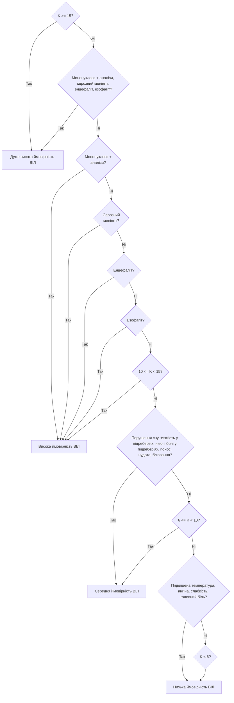

# ЛАБОРАТОРНА РОБОТА 2

## Побудова на Lisp двійкового дерева рішень діагностичної бази знань

**Виконав:** Семен Прохода ІП-з31

### Завдання до роботи:

**Варіант 13:** "ВІЛ-інфекція" <br>
Побудувати двійкове дерево прийняття рішень і реалізувати його на мові Lisp.

### Двійкове дерево



### Лістниг

#### [`hiv.lisp`](./hiv.lisp)

```lisp

```

### Результати роботи програми

```

```

### Висновок:

