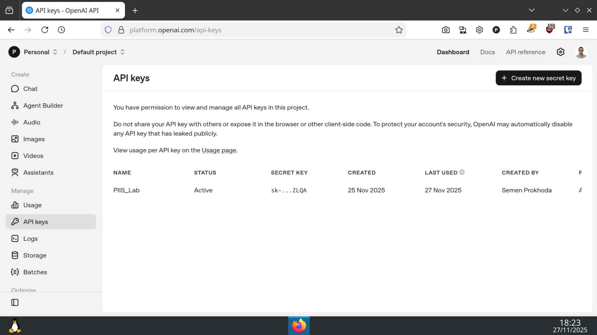
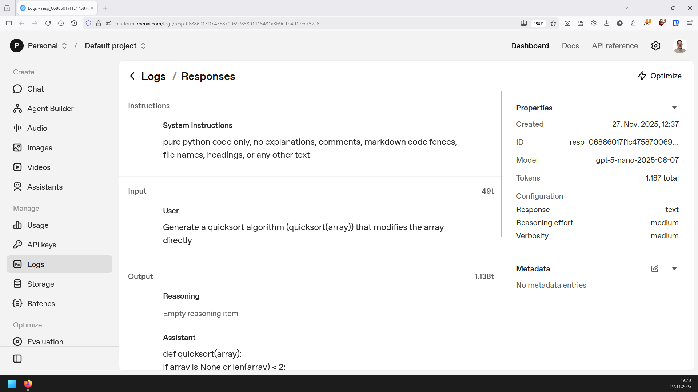
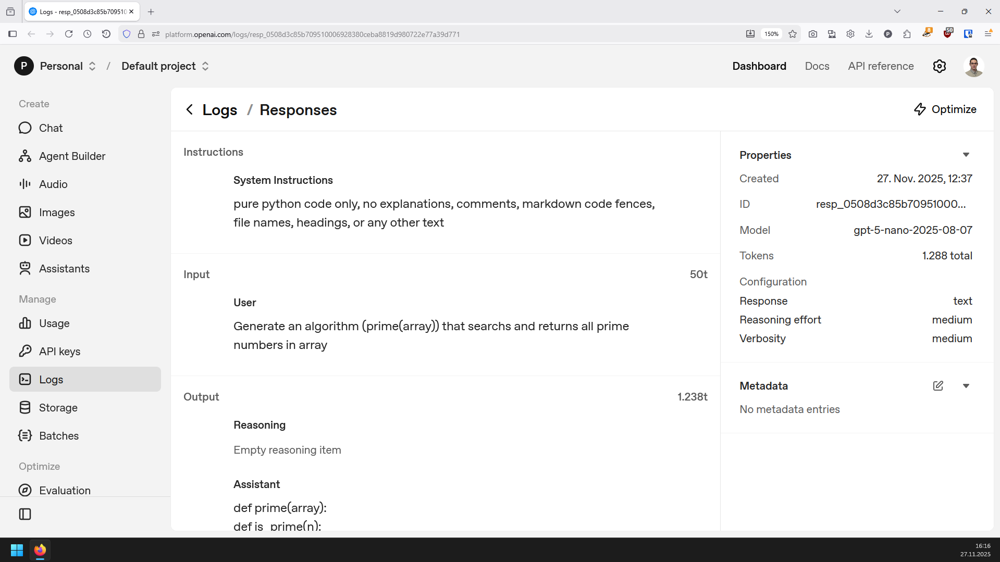

# ЛАБОРАТОРНА РОБОТА 4-5

## Програмування на Python за допомогою штучного інтелекту ChatGPT

**Виконав:** Семен Прохода ІП-з31

### Завдання до роботи:

Використати OpenAI API у Python для створення алгоритмів.

### Виконання:

#### Створення ключа OpenAI API



#### Лістинг: [`aialgorithms.ipynb`](aialgorithms.ipynb)

```python 
from openai import OpenAI
import json

with open("keys.json") as f:
    keys = json.load(f)

client = OpenAI(api_key=keys["openai_api"])
model = "gpt-5-nano"
instructions = "pure python code only, no explanations, comments, markdown code fences, file names, headings, or any other text"

response = client.responses.create(
    model=model,
    instructions=instructions,
    input="Generate a quicksort algorithm (quicksort(array)) that modifies the array directly",
)

print(response.output_text)
```

код згенерований ШІ:

```python
def quicksort(array):
    if array is None or len(array) < 2:
        return
    def partition(a, low, high):
        pivot = a[high]
        i = low
        for j in range(low, high):
            if a[j] <= pivot:
                a[i], a[j] = a[j], a[i]
                i += 1
        a[i], a[high] = a[high], a[i]
        return i
    def _quicksort(a, low, high):
        if low < high:
            p = partition(a, low, high)
            _quicksort(a, low, p - 1)
            _quicksort(a, p + 1, high)
    _quicksort(array, 0, len(array) - 1)
```

```python
exec(response.output_text)

import random

arr = [random.randint(0, 10000) for _ in range(1000)]

print(arr)

quicksort(arr)

print(arr)
```

```
[6044, 732, 240, 6225, 3357, 770, 3530, 9388, 2683, 6230, 4097, 720, ...
[25, 27, 34, 45, 57, 66, 84, 104, 105, 116, 122, 144, 152, 163, 167, ...
```

```python
responsePrime = client.responses.create(
    model=model,
    instructions=instructions,
    input="Generate an algorithm (prime(array)) that searchs and returns all prime numbers in array",
)

print(responsePrime.output_text)
```

код згенерований ШІ:

```python
def prime(array):
    def is_prime(n):
        if not isinstance(n, int):
            return False
        if n < 2:
            return False
        if n == 2 or n == 3:
            return True
        if n % 2 == 0 or n % 3 == 0:
            return False
        i = 5
        while i * i <= n:
            if n % i == 0 or n % (i + 2) == 0:
                return False
            i += 6
        return True

    result = []
    for x in array:
        if is_prime(x):
            result.append(x)
    return result
```

```python
exec(responsePrime.output_text)

print(prime(arr))
```

```
[163, 167, 211, 229, 233, 269, 277, 383, 401, 419, 457, 503, 577, 661, ...
```

#### Логи:



